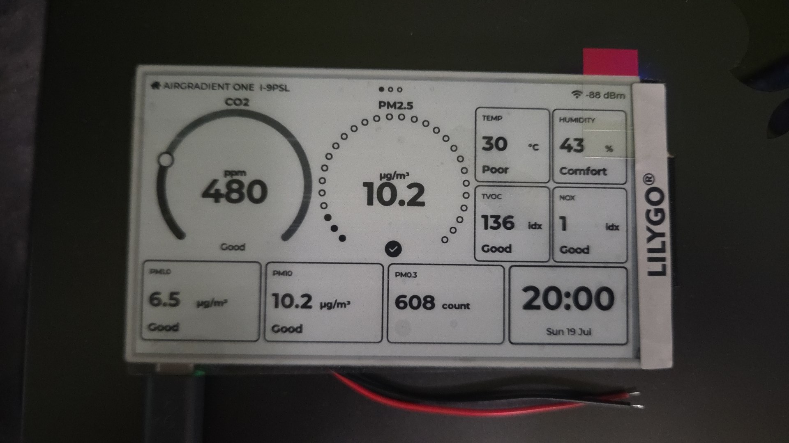
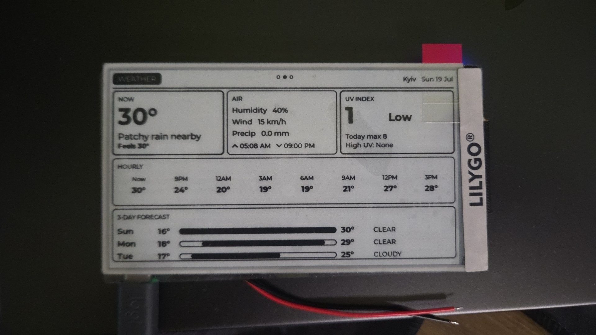
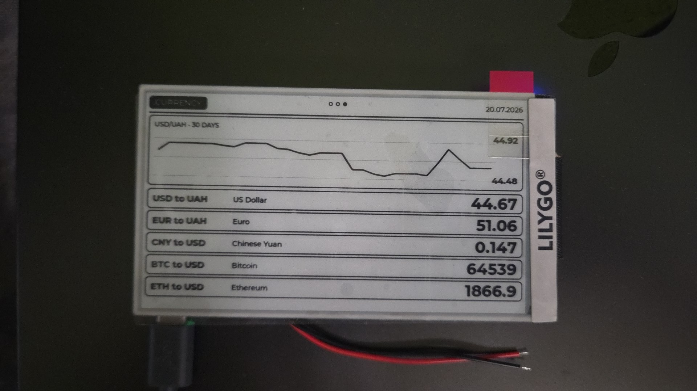
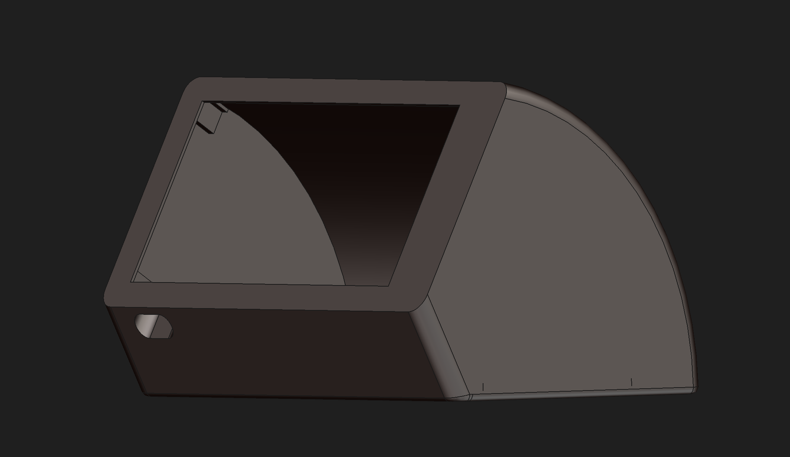

<div align="center">

# 🌬️ airdeck

### *Your AirGradient ONE, reborn on gorgeous 4.7″ e-ink.* ✨

[](https://github.com/worxbend/airgradient-papr/actions/workflows/ci.yml)
[](https://github.com/worxbend/airgradient-papr/actions/workflows/release.yml)


[](LICENSE)

**No cloud. No app. No subscription.** Just your air, your weather, and your money — rendered paper-crisp on a display you can read from across the room. 🔒📈



</div>

---

## 💡 What is this?

You bought an **[AirGradient ONE](https://www.airgradient.com/)** 🟢 because you actually care about the air you breathe. Great taste. But squinting at an RGB LED strip or unlocking your phone to see a number? *Weak.*

**airdeck** is standalone firmware for a **LILYGO T5-4.7″ ESP32 e-paper** board that adopts your AirGradient ONE and gives it the panoramic, zero-glare, always-on dashboard it deserves — talking to the sensor **entirely over your LAN** via its local API. Then it goes further: **outdoor weather, a 3-day forecast, UV, and live FX + crypto rates.** Because why should a screen this nice only do one thing? 😎

<div align="center">

&nbsp;&nbsp;

</div>

---

## 🟢 The AirGradient integration (the whole point)

airdeck speaks the **AirGradient ONE local-server API** — no AirGradient cloud account, no internet round-trip:

```
GET http://<your-monitor-ip>/measures/current   →   JSON, every 30 s
```

Every field the I-9PSL exposes lands on the panel:

| 🫁 Air | 🌡️ Comfort | 🧪 Chemistry | ℹ️ Meta |
|---|---|---|---|
| CO₂ (ppm) | Temperature | TVOC index + raw | firmware / model |
| PM1.0 / PM2.5 / PM10 | Humidity | NOx index + raw | boot count · LED mode |
| PM0.3 particle count | (compensated too) | | RSSI |

…all classified with **US EPA AQI** (PM2.5) and per-metric health bands (Good / Moderate / Elevated / Unhealthy). CO₂ and PM2.5 — the two with the clearest thresholds — get their own **gauges**. 🎯

> **Prereqs:** AirGradient firmware **≥ 3.0.10** with the local API enabled, and a **DHCP reservation** so the monitor's IP never drifts. That's it. ✅

Huge respect to the folks at **[AirGradient](https://github.com/airgradienthq)** for building open, hackable, honest hardware. 🙏

---

## 🖥️ The pages

Three full-screen pages, flipped with the board's three buttons — **◀ prev · ⌂ main · next ▶** — with a little paging dot indicator up top.

### 1️⃣ AirGradient  ·  *the main event*
CO₂ as a sweeping **arc gauge with a knob**, PM2.5 as a **dotted ring** that fills to the value, a 2×2 tile block (temp / humidity / TVOC / NOx), a PM detail row (PM1.0 / PM10 / PM0.3), and a big clock. 🕗

### 2️⃣ Weather  ·  *look outside without looking outside*
Current conditions + an **AIR** panel (humidity / wind / precip / sunrise–sunset) + a **UV** panel (index, risk band, today's max, high-UV window), an **8-slot hourly strip**, and a **3-day forecast** with min–max range bars. Auto-geolocated 📍, no API key.

### 3️⃣ Currency  ·  *because vibes require context*
A **30-day USD→UAH line chart** 📉 over live rate rows: **USD→UAH · EUR→UAH · CNY→USD** (National Bank of Ukraine) and **BTC→USD · ETH→USD** (CoinGecko). All free, key-less, public APIs.

> On boot, a 🌀 **splash screen** fetches every data source first, then renders the pages fully-formed — no half-empty screens.

---

## 🧰 Hardware

| Part | Notes |
|---|---|
| 🧠 **LILYGO T5-4.7″ V1** | ESP32-**WROVER-E**, 16 MB flash, 8 MB PSRAM, ED047TC1 960×540 e-paper |
| 🟢 **AirGradient ONE (I-9PSL)** | your air sensor, on the same Wi-Fi |
| 🔌 USB-A→C data cable | ⚠️ *not* C-to-C — the board lacks CC pulldowns |
| 🔋 *(optional)* 3.7 V LiPo | JST-PH — **check polarity with a multimeter first!** |

---

## 🚀 Quick start

```bash
# 1. Grab the code + PlatformIO
git clone https://github.com/worxbend/airgradient-papr.git && cd airdeck
pip install platformio

# 2. Tell it about your Wi-Fi + monitor
cp include/config.example.hpp include/config.hpp
$EDITOR include/config.hpp          # SSID, password, http://<monitor-ip>/measures/current, timezone

# 3. Sanity-check the sensor is reachable
curl http://<monitor-ip>/measures/current   # should spit JSON

# 4. Flash it 🔥  (board on /dev/ttyUSB0)
pio run -e t5-epd47-v1 -t upload

# 5. Watch it wake up
pio device monitor
```

```text
[airdeck] boot
[boot] PSRAM: 4192123 bytes free
[net] ok #1  CO2=480 PM2.5=10.2 T=30 RH=43
[wx]  Kyiv 30C UV 1 Patchy rain nearby
[cur] USD=44.67 EUR=51.06 BTC=64539 hist=32
```

Prefer a one-shot image? Every tagged release ships a **single-file factory `.bin`** — flash it at `0x0` with `esptool` and go. 📦

### 🛰️ Over-the-air updates
Once it's on Wi-Fi it advertises **ArduinoOTA** + a **`/health`** JSON endpoint:

```bash
pio run -e t5-epd47-v1 -t upload --upload-port airdeck.local   # no USB needed
curl http://airdeck.local/health                                # uptime, heap, poll stats
```

---

## 🏗️ Under the hood

- **Hexagonal-ish** layout: a pure, host-tested `domain/` (AQI, banding, trend) with thin `adapters/` (HTTP, e-paper, buttons) and `ui/` pages.
- **Two FreeRTOS tasks + a mailbox** — networking on core 0, LVGL on core 1, no locks.
- **LVGL 9.2** rendering **L8 → 4 bpp**, its heap pool living in **PSRAM** so Wi-Fi + the e-paper driver keep their internal RAM.
- **Panel-care baked in** (a hard requirement, not an afterthought): power discipline, full-refresh cadence, temperature clamp, boot hygiene, and a heap-gated refresh so a fetch spike can never wedge the display.

See [`docs/DECISIONS.md`](docs/DECISIONS.md) for the war stories 🪖 and [`PLAN.md`](PLAN.md) for the full design + panel-protection handbook.

### Environments
| env | target |
|---|---|
| `t5-epd47-v1` | **default** — the WROVER-E board, USB always-on |
| `t5-epd47-v1-batt` | battery deep-sleep single-shot profile |
| `t5-epd47-s3` | future ESP32-S3 unit |
| `native-test` | host unit tests for `domain/` |

---

## 🤖 CI/CD

Every push is put through its paces by GitHub Actions:

- 🧪 **Unit tests** — the `domain/` layer on the host
- 🔧 **Build matrix** — firmware for every device env, artifacts uploaded
- 🎨 **clang-format** — style stays honest
- 🚀 **Release** — tag `v*` → builds + merges a factory image → publishes a GitHub Release
- 🤖 **Dependabot** — keeps the Actions fresh

---

## 📦 Enclosure

<div align="center">

</div>

A slick, angled desk-stand case is in the works. **FreeCAD source + print-ready `.3mf`** are coming soon™ — drop them in `hardware/` and print away. 🖨️

---

## 🛟 Gotchas worth knowing

- 🔌 Use a **USB-A→C** cable (C-to-C won't enumerate).
- 🪫 On battery: **verify JST-PH polarity with a multimeter** before first connect — AliExpress pigtails aren't standardized.
- 📌 Give the AirGradient a **DHCP reservation**.
- ☀️ Keep the panel out of **direct sunlight** — e-ink hates UV.
- 🔩 Never repurpose strapping pins **GPIO0/2/5/12/15**.

---

## ❤️ Credits & kin

- 🟢 **[AirGradient](https://www.airgradient.com/)** — the open sensor that started it all
- 🖼️ **[LVGL](https://lvgl.io/)** · **[epdiy](https://github.com/vroland/epdiy)** / **[LilyGo-EPD47](https://github.com/Xinyuan-LilyGO/LilyGo-EPD47)** — pixels on paper
- 🌦️ **[wttr.in](https://github.com/chubin/wttr.in)** · **[Open-Meteo](https://open-meteo.com/)** · 🏦 **[NBU](https://bank.gov.ua/)** · 🪙 **[CoinGecko](https://www.coingecko.com/)** — the data
- 🛠️ More builds at **[github.com/worxbend](https://github.com/worxbend)**

<div align="center">

**Built with 🫁, ☕, and a healthy distrust of the cloud.**

*If airdeck made your air visible, drop a ⭐.*

</div>
